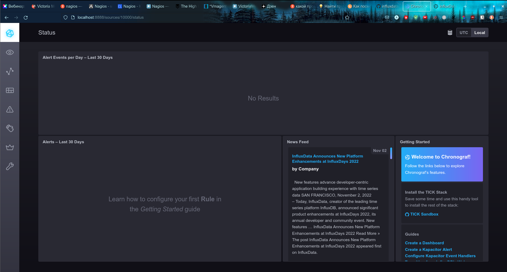
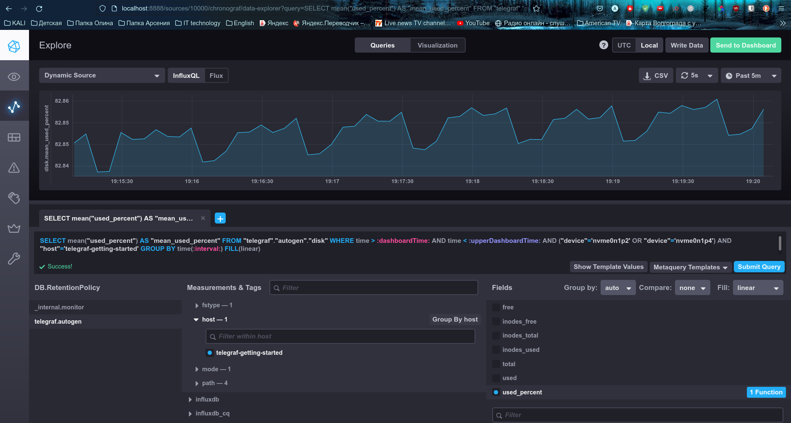
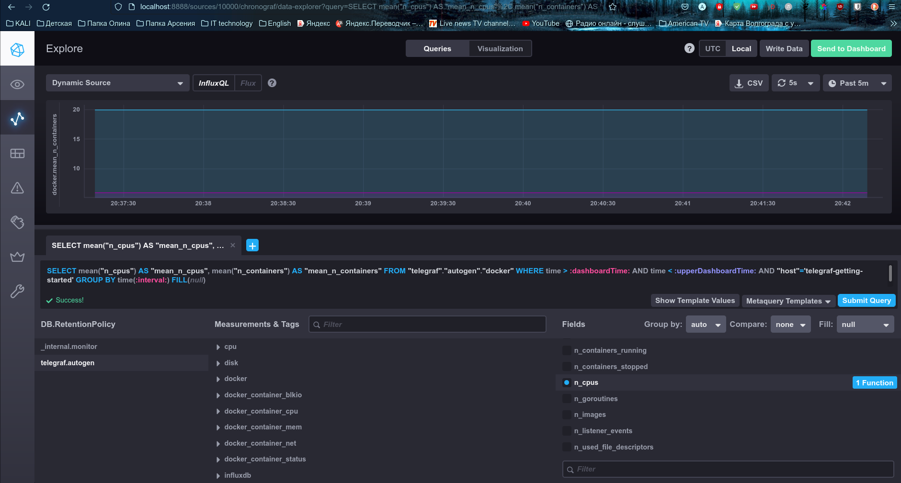
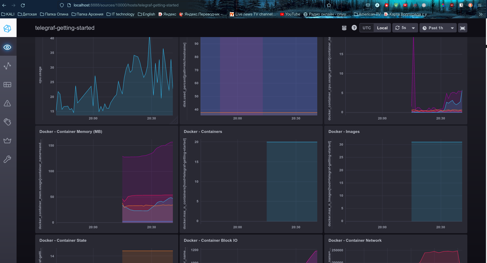

# Домашнее задание к занятию "10.02. Системы мониторинга"

## Обязательные задания

1. Опишите основные плюсы и минусы pull и push систем мониторинга.
```
Плюсы pull модели: (копипаст лекции с дополнением)
 - легче контролировать
   (возможность коннекта по SSL  к агентам)
 - можно настроить единый proxy-server для всех агентов с TLS
 - упрощенная отладка получения данных с агентов (самостоятельный опрос)
 - возможно отключение алертинга  
Плюсы push модели:
 - отправка данных с агентов в единую БД (возможность резервного копирования)
 - данные передаются по  UDP
 - гибкая настройка отправки пакетов с метриками
 - удобно хранить и получать данные
 - удобно обрабатывать метрики по заданным параметрам 
 
```

2. Какие из ниже перечисленных систем относятся к push модели, а какие к pull? А может есть гибридные?
```
    - Prometheus  pull модель 
      exporter агент собирает метрики с хост-машин, опрашиваемые server

    - TICK push модель
        telegraph собирает и отправляет данные в tsdb (можно настроить для работы в pull-модели)
        
    - Zabbix можно настроить в соответствии с pull or push моделью
      agent собирает метрики и отправляет на server

    - VictoriaMetrics больше push модель
      масштабируемая база данных временных рядов, работает совместно с другими системами мониторинга 
      например prometheus
      
    - Nagios pull  модель (платная)
      архитектура сервер-агент, агенты (плагины) устанавливаются на контролируемых хостах
    
```
3. Склонируйте себе [репозиторий](https://github.com/influxdata/sandbox/tree/master) и запустите TICK-стэк, 
используя технологии docker и docker-compose.(по инструкции ./sandbox up )

В виде решения на это упражнение приведите выводы команд с вашего компьютера (виртуальной машины):
```
    - curl http://localhost:8086/ping
arsen@lite:~$ curl http://localhost:8086/ping -v
*   Trying ::1...
* TCP_NODELAY set
* Expire in 150000 ms for 3 (transfer 0x56364f7a50f0)
* Expire in 200 ms for 4 (transfer 0x56364f7a50f0)
* Connected to localhost (::1) port 8086 (#0)
> GET /ping HTTP/1.1
> Host: localhost:8086
> User-Agent: curl/7.64.0
> Accept: */*
> 
< HTTP/1.1 204 No Content
< Content-Type: application/json
< Request-Id: 94fb29b6-627d-11ed-805d-0242ac120002
< X-Influxdb-Build: OSS
< X-Influxdb-Version: 1.8.10
< X-Request-Id: 94fb29b6-627d-11ed-805d-0242ac120002
< Date: Sat, 12 Nov 2022 11:31:42 GMT
< 
* Connection #0 to host localhost left intact


    - curl http://localhost:8888
*   Trying ::1...
* TCP_NODELAY set
* Expire in 150000 ms for 3 (transfer 0x564ab5bdf0f0)
* Expire in 200 ms for 4 (transfer 0x564ab5bdf0f0)
* Connected to localhost (::1) port 8888 (#0)
> GET / HTTP/1.1
> Host: localhost:8888
> User-Agent: curl/7.64.0
> Accept: */*
> 
< HTTP/1.1 200 OK
< Accept-Ranges: bytes
< Cache-Control: public, max-age=3600
< Content-Length: 414
< Content-Security-Policy: script-src 'self'; object-src 'self'
< Content-Type: text/html; charset=utf-8
< Etag: ubyGAbz3Tc69bqd3w45d4WQtqoI=
< Vary: Accept-Encoding
< X-Chronograf-Version: 1.10.0
< X-Content-Type-Options: nosniff
< X-Frame-Options: SAMEORIGIN
< X-Xss-Protection: 1; mode=block
< Date: Sat, 12 Nov 2022 11:37:11 GMT
< 
* Connection #0 to host localhost left intact
<!DOCTYPE html><html><head><link rel="stylesheet" href="/index.c708214f.css"><meta http-equiv="Content-type" content="text/html; charset=utf-8"><title>Chronograf</title><link rel="icon shortcut" href="/favicon.70d63073.ico"></head><body> <div id="react-root" data-basepath=""></div> <script type="module" src="/index.e81b88ee.js"></script><script src="/index.a6955a67.js" nomodule="" defer></script> </body></html>arsen@

    - curl http://localhost:9092/kapacitor/v1/ping
*   Trying ::1...
* TCP_NODELAY set
* Expire in 150000 ms for 3 (transfer 0x556a3d04b0f0)
* Expire in 200 ms for 4 (transfer 0x556a3d04b0f0)
* Connected to localhost (::1) port 9092 (#0)
> GET /kapacitor/v1/ping HTTP/1.1
> Host: localhost:9092
> User-Agent: curl/7.64.0
> Accept: */*
> 
< HTTP/1.1 204 No Content
< Content-Type: application/json; charset=utf-8
< Request-Id: a655bdfb-627f-11ed-80c5-0242ac120005
< X-Kapacitor-Version: 1.6.5
< Date: Sat, 12 Nov 2022 11:46:30 GMT
< 
* Connection #0 to host localhost left intact


```
А также скриншот веб-интерфейса ПО chronograf (`http://localhost:8888`). 





P.S.: если при запуске некоторые контейнеры будут падать с ошибкой - проставьте им режим `Z`, например
`./data:/var/lib:Z`

4. Изучите список [telegraf inputs](https://github.com/influxdata/telegraf/tree/master/plugins/inputs).
    - Добавьте в конфигурацию telegraf плагин - [disk](https://github.com/influxdata/telegraf/tree/master/plugins/inputs/disk):
    ```
    [[inputs.disk]]
      ignore_fs = ["tmpfs", "devtmpfs", "devfs", "iso9660", "overlay", "aufs", "squashfs"]
    ```
    - Так же добавьте в конфигурацию telegraf плагин - [mem](https://github.com/influxdata/telegraf/tree/master/plugins/inputs/mem):
    ```
    [[inputs.mem]]
    ```
SELECT mean("used_percent") AS "mean_used_percent" FROM "telegraf"."autogen"."disk" WERE time > now() - 30m AND "host"='3b17b994f419'

    - После настройки перезапустите telegraf.
 
    - Перейдите в веб-интерфейс Chronograf (`http://localhost:8888`) и откройте вкладку `Data explorer`.
    - Нажмите на кнопку `Add a query`
    - Изучите вывод интерфейса и выберите БД `telegraf.autogen`
    - В `measurments` выберите mem->host->telegraf_container_id , а в `fields` выберите used_percent. 
    Внизу появится график утилизации оперативной памяти в контейнере telegraf.
    - Вверху вы можете увидеть запрос, аналогичный SQL-синтаксису. 
    Поэкспериментируйте с запросом, попробуйте изменить группировку и интервал наблюдений.
    - Приведите скриншот с отображением
    метрик утилизации места на диске (disk->host->telegraf_container_id) из веб-интерфейса.  




5. Добавьте в конфигурацию telegraf следующий плагин - [docker](https://github.com/influxdata/telegraf/tree/master/plugins/inputs/docker):
```
[[inputs.docker]]
  endpoint = "unix:///var/run/docker.sock"
```

Дополнительно вам может потребоваться донастройка контейнера telegraf в `docker-compose.yml` дополнительного volume и 
режима privileged:
```
  telegraf:
    image: telegraf:1.4.0
    privileged: true
    volumes:
      - ./etc/telegraf.conf:/etc/telegraf/telegraf.conf:Z
      - /var/run/docker.sock:/var/run/docker.sock:Z
    links:
      - influxdb
    ports:
      - "8092:8092/udp"
      - "8094:8094"
      - "8125:8125/udp"
```

После настройки перезапустите telegraf, обновите веб интерфейс и приведите скриншотом список `measurments` в 
веб-интерфейсе базы telegraf.autogen . Там должны появиться метрики, связанные с docker.





Факультативно можете изучить какие метрики собирает telegraf после выполнения данного задания.

## Дополнительное задание (со звездочкой*) - необязательно к выполнению

В веб-интерфейсе откройте вкладку `Dashboards`. Попробуйте создать свой dashboard с отображением:

    - утилизации ЦПУ
    - количества использованного RAM
    - утилизации пространства на дисках
    - количество поднятых контейнеров
    - аптайм
    - ...
    - фантазируйте)
    
    ---

### Как оформить ДЗ?

Выполненное домашнее задание пришлите ссылкой на .md-файл в вашем репозитории.

---

